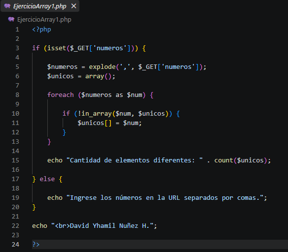

# Guia del proyecto Laboratorio 03

Esta guia explica el trabajo realizado en el Laboratorio 03 sobre trabajo colaborativo con Git y GitHub. Esta informacion esta pensada para un compañero que nunca ha visto el proyecto.

## Objetivo del proyecto

El objetivo es aprender a trabajar con un repositorio compartido, crear cambios, registrar los cambios con commits y trabajar con ramas.

### Herramientas utilizadas

- Git para controlar las versiones del proyecto.
- GitHub para almacenar el repositorio remoto.
- Visual Studio Code para editar los archivos.

## Instalacion y uso

Para trabajar con el proyecto primero se debe tener instalado Git y Visual Studio Code. Puedes comprobar que Git esta instalado ejecutando `git --version`.

Los pasos para obtener y utilizar el proyecto son:

1. Copiar la direccion del repositorio desde GitHub.
2. Abrir PowerShell o una terminal.
3. Ejecutar el comando `git clone` con la direccion del repositorio.
4. Entrar a la carpeta del proyecto con `cd`.
5. Abrir el proyecto en Visual Studio Code.
6. Realizar los cambios necesarios y guardarlos.

## Avance del proyecto

### Tareas realizadas

- [x] Crear el repositorio del proyecto.
- [x] Crear y utilizar ramas.
- [x] Realizar commits.
- [ ] Mejorar la documentacion del proyecto.

## Comandos principales

Estos son algunos comandos utilizados durante el trabajo:

```bash
git clone URL_DEL_REPOSITORIO
git status
git add .
git commit -m "Actualiza el proyecto"
git push origin main
```

## Archivos y comandos

| Elemento | Que hace | Ejemplo |
|----------|----------|---------|
| README.md | Contiene la informacion principal | Documentacion |
| git add | Prepara los cambios | git add . |
| git commit | Guarda los cambios | git commit -m "Actualiza" |
| git push | Sube los cambios a GitHub | git push origin main |

## Enlace externo

Puedes consultar la documentacion oficial de Git en [Git](https://git-scm.com/).

## Captura del trabajo



> Documentar el proyecto permite que otras personas puedan entenderlo y utilizarlo con mayor facilidad.